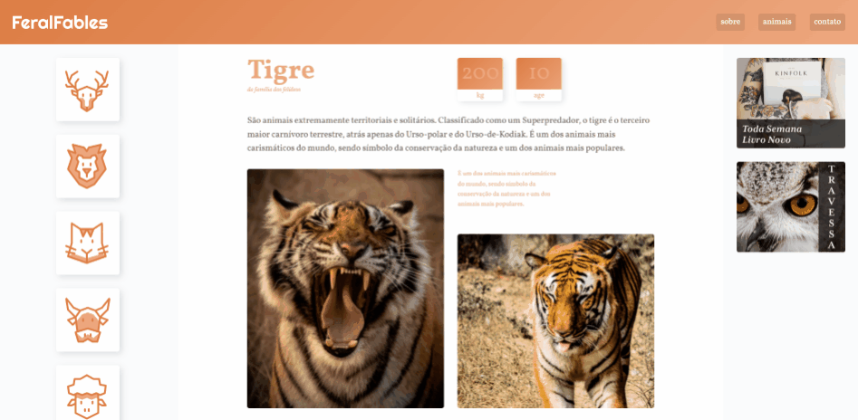

# feralfables

Feral Fables is a website project developed during the CSS Grid layout mini-course at [Origamid.com](https://www.origamid.com/). The primary purpose of this project is to demonstrate and reinforce knowledge about Grids in CSS, with almost the entire website built using Grids.

## Demo

[Click here](https://barata-ribeiro.github.io/feralfables/) to see a live demo of the website.



## Introduction

The Feral Fables project showcases the use of CSS Grids to create a responsive and clean layout. The original design proposed by the course was called "Wildbeast", but some changes were made to the logo, images, and content for personal preferences. These changes are unrelated to the course objectives.

## Technologies Used

- HTML
- CSS

## Features

-   Responsive design using CSS Grids
-   Clean and modern layout
-   Easily customizable

## Getting Started

To get started with this project, follow these steps:

1. Clone the repository:

```
git clone https://github.com/Barata-Ribeiro/feralfables.git
```

2. Navigate to the project folder:

```
cd feralfables
```

3. Explore and modify the code to suit your needs. You can open the `index.html` file in your browser or use LiveServer.

## Contributing

If you find any issues or have suggestions for improvements, feel free to open an issue or submit a pull request.

## License

This project is released under the [MIT License](LICENSE).
